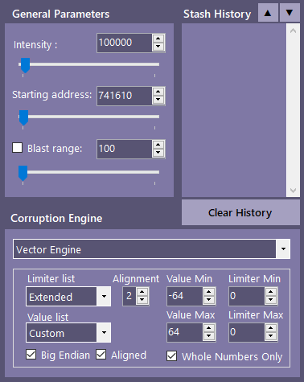

# Dolphin Narry's mod \(Deprecated\)


This is documentation for the old "WGH + Dolphin Narry's Mod" method of corruption Gamecube/Wii games. This page is kept for information archival purposes. This documentation is for valid for RTC 3.xx versions only.


## Gamecube & Wii Savestate Corruption

## Index

[Index](gamecube-and-wii-savestate-corruption.md#index)

* [Dolphin Narry's Mod](gamecube-and-wii-savestate-corruption.md#dolphin-narrys-mod)
* [The Concept of Savestates](gamecube-and-wii-savestate-corruption.md#the-concept-of-savestates)
* [A Brief Overview of the Consoles](gamecube-and-wii-savestate-corruption.md#a-brief-overview-of-the-consoles)
* [Corrupting the Savestates](gamecube-and-wii-savestate-corruption.md#corrupting-the-savestates)
  * [The Savestate Info Tool](gamecube-and-wii-savestate-corruption.md#the-savestate-info-tool)
  * [Additional Info](gamecube-and-wii-savestate-corruption.md#additional-info)

## Dolphin Narry's Mod

#### Author: [Narry/Smellyfeetyouhave](https://narry.land)

#### Source: [https://github.com/NarryG/dolphin/](https://github.com/NarryG/dolphin/)

#### Download: [https://github.com/NarryG/dolphin/releases](https://github.com/NarryG/dolphin/releases)

Dolphin Narry's Mod is a modification of Dolphin which contains various changes dedicated to making the savestate corruption method work. You'll need to use this version of Dolphin if you want to corrupt the savestates.

## The concept of Savestates

A savestate at its core contains the information that the emulator needs to restore itself to a specific "state". Included in this data is a copy of the system memory. That means if we corrupt the memory within the savestate then load the state, we can indirectly corrupt the system memory similar to what you do with the RTC.

## A Brief Overview of the Consoles

### The Gamecube has:

* **24MB** of system ram \(**SRAM**\)
* **16MB** of audio ram \(**ARAM**\)

The SRAM is the main system memory. While the ARAM is technically designed to be used for storing data related to audio, through various tricks developers were able to use it as low bandwidth memory.

Not all games utilize the ARAM for storing data. Those that do tend to store geometry data in it as the ARAM is fairly slow.

### The Wii has:

* **24MB** of system ram \(**SRAM**\)
* **64MB** of external ram \(**EXRAM**\)

The SRAM is the main system memory. The EXRAM is additional memory which can be used. The EXRAM is slightly slower than the SRAM. Generally, the most important data will be in the SRAM \(code, game vital content, etc\).

## Corrupting the Savestates

First you'll need to load the Savestate in the Windows Glitch Harvester, once it's loaded, you're going to want to enable caching on the file to speed things up.

### The Savestate Info Tool

Recent versions of the [Windows Glitch Harvester ](../../corruptors/rtc/windows-glitch-harvester.md)have a tool called the "Savestate Info" tool. This tool gives you information on the addresses of the SRAM, ARAM, and EXRAM within a Dolphin Savestate. Just load up the savestate, press the button, and you'll be able to see the starting addresses.

* The "Domain" column shows the name of the memory domain
* The "Offset" column shows you the starting address. You can calculate the end address by adding the size of the domain to the starting address \(domain sizes listed above\)
* The "Alignment" column tells you how the memory domain is aligned in the savestate. The Vector Engine hunts for 32-bit aligned floats. If they aren't 4-byte aligned, this will tell you how many bytes off it is. You'll need to set the "Alignment" box in the Vector Engine Config box to match the alignment for it to work properly. If you're using "Target Dolphin", this'll automatically be set for you.
* The "Start Netcore Button" starts the Netcore2 server. If the Netcore2 server is already started, the button will restart the server.

### Target Dolphin

WGH 0.9.3 bring a new feature with Netcore Implementation called "Target Dolphin". If you swap your target mode to Target Dolphin, you can connect directly with Dolphin Narry's Mod via Netcore and it'll automatically load your corrupted savestate when you blast/inject.

### Additional Info

The Gamecube and Wii are both based on the PowerPC architecture, so they're **Big Endian**. Be sure to check the Big Endian box in the vector engine. If you're using "Target Dolphin", this should be handled for you.

A good starting value for the Intensity is around 50,000-100,000 and you can go from there. Here's an example screenshot of what your config may look like:

