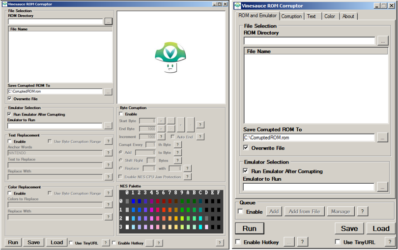
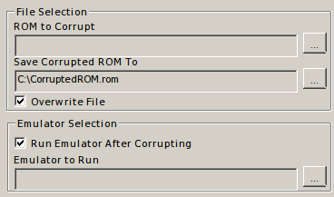
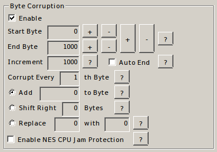

# Vinesauce ROM Corruptor

> ## Note:
>
> **While you can still use this corruptor, we suggest using the** [**Real Time Corruptor**](http://redscientist.com/rtc) **whenever you can. The RTC is under active development and has far more features than other corruptors.**
>
> \*\*\*\*[**You can view the wiki pages for the Real Time Corruptor here**](rtc/)\*\*\*\*

### Vinesauce ROM Corruptor

**Author: Ryan "Rikerz" Sammon**

**Source: https://github.com/Rikerz/VRC**

**Download: https://github.com/Rikerz/VRC/tree/master/bin**

The Vinesauce ROM Corruptor is a corruptor that allows you to change the bytes of any file by tweaking some simple settings. Its development thus far has been biased toward corrupting NES ROM files for the best corruption effects, but since it works on any file, it can be used to corrupt any kind of ROM or game data file.

#### Index

* [**Index**](vinesauce-rom-corruptor.md#index)
  * [**Functions**](vinesauce-rom-corruptor.md#functions)
    * [File Selection - ROM Directory](vinesauce-rom-corruptor.md#file-selection---rom-directory)
    * [Save Corrupted ROM To](vinesauce-rom-corruptor.md#save-corrupted-rom-to)
    * [Run Emulator after Corrupting](vinesauce-rom-corruptor.md#run-emulator-after-corrupting)
    * [Save](vinesauce-rom-corruptor.md#save)
    * [Load](vinesauce-rom-corruptor.md#load)
  * [**Byte Corruption**](vinesauce-rom-corruptor.md#byte-corruption)
    * [Start Byte](vinesauce-rom-corruptor.md#start-byte---hex)
    * [End Byte](vinesauce-rom-corruptor.md#end-byte---hex)
    * [Increment](vinesauce-rom-corruptor.md#increment---decimal)
    * [Auto End](vinesauce-rom-corruptor.md#auto-end)
    * [Corrupt every nth Byte](vinesauce-rom-corruptor.md#corrupt-every-nth-byte---decimal)
    * [Add x to every byte](vinesauce-rom-corruptor.md#add-x-to-every-byte---decimal)
    * [Shift right](vinesauce-rom-corruptor.md#shift-right-by-x-bytes---decimal)
    * [Replace x with y ](vinesauce-rom-corruptor.md#replace-x-with-y---hex)
    * [Enable NES CPU Jam Protection](vinesauce-rom-corruptor.md#enable-nes-cpu-jam-protection)
    * [Text Replacement](vinesauce-rom-corruptor.md#text-replacement---ascii)
    * [Color Replacement](vinesauce-rom-corruptor.md#color-replacement---hex)
  * [**Quick Corruption Setup**](vinesauce-rom-corruptor.md#quick-corruption-setup)
  * [**Example Corruption Saves**](vinesauce-rom-corruptor.md#example-corruption-saves)
  * [**Video Tutorials**](vinesauce-rom-corruptor.md#video-tutorials)

#### Functions

**File Selection - ROM Directory**

Choose a folder containing your files or ROMs, a selection of the files from the selected folder will display, clicking on one of the files once will select it as the target file to corrupt.

**Save Corrupted ROM To**

This sets the a destination path for the corrupted file/ROM, ticking "Overwrite File" will always replace the file/ROM in the set destination.

**Run Emulator after Corrupting**

This launches an emulator and runs the corrupted ROM after clicking 'Run'. Some emulators may require you launch the corrupted ROM manually. See a list of recommended emulators.

**Save**

You can save your corruption to a .txt file or a TinyURL link when enabled and share it with others, be sure to update the path of the ROM when loading a save. Please note that TinyURL links sometimes expire and won't keep your corruption save forever.

**Load**

You can load saved corruptions in .txt format or load a TinyURL link to corrupt your own ROMs.

#### Byte Corruption

This section is where you configure the corruptions settings.

**Start Byte - Hex**

This sets the starting value for the corruption, setting this value too low will likely result in corrupting the header which can prevent the emulator from reading the file properly. A recommended starting value is 500.

**End Byte - Hex**

This sets the end value for the corruption, it can be set anywhere after the start byte. Setting this value too close to the start byte makes the byte range for corrupting too narrow for any significant corruption to happen, however, this can be useful for pinpointing files or values to corrupt.

**Increment - Decimal**

This sets the byte increment for when you are using the + and - buttons to change the start end end bytes. Setting the increment value to 1000 will increase or decrease the value of the start or end byte by 1000 when using + and -.

**Auto End**

When selected it will set the end byte to the last value of the ROM/file.

**Corrupt every nth Byte - Decimal**

This value sets how often to corrupt bytes, setting this to 1 will corrupt every byte, setting it to 2 will corrupt every second byte, and so on. The higher the number the less likely corrupting will happen, the lower the value the more likely a crash will occur. 10 is a recommended value to start out with.

**Add x to every byte - Decimal**

When using this option it will add the specified decimal value to each byte corrupted, any bytes corrupted with this option will be increased by the specified value. You can set negative values with this option too.

**Shift right by x bytes - Decimal**

Using this option each corrupted byte will be shifted to the right from it's original position, using a negative value will shift the bytes to the left.

**Replace x \_with y \_- HEX**

When using this option, each corrupted byte will be compared to the first value \(_x\), \_if it matches it will be replaced with_ \(y\), \_the second value. So only matching bytes will be corrupted, other bytes remain untouched.

**Enable NES CPU Jam Protection**

This option will increase stability and decrease crashes when corrupting NES ROMs by avoiding known important NES operations and by avoiding changing certain values known to cause jams in the NES CPU. This option does not effect anything other than NES ROMs.

**Text Replacement - ASCII**

Anchor Text **-** Enter at least one word that you know exists in the file into this field. These words are used to understand what encoding the text in the file has. Usually one word is enough.

Text To Replace **-** Enter the text to replace into this field. Multiple sections of text can be replaced by putting pipe characters \(\|\) between them. Any characters that are not letters \(ie. numbers, spaces, hyphens, etc.\) will match any character in the file. Small sections of text will result in greater collateral corruption of the file, as they will match non-text data more often.

Replace With **-** Enter what to replace the matching sections of text with into this field. If multiple sections of text were added into the box above, the same number of sections must also be entered into this box. Again, the pipe character \(\|\) is used to separate sections.

A more detailed guide can be found here: [http://corruptedbytes.com/vinesauce-rom-corruptor-text-replacement-guide/](http://corruptedbytes.com/vinesauce-rom-corruptor-text-replacement-guide/)

**Color Replacement - Hex**

This allows you to arbitrarily replace colors in games. Enter the hexadecimal value of the color to replace into the first text box. Multiple colors can be replaced at the same time by putting pipe characters \(\|\) between them. Enter the hexadecimal value to replace the matching color with into this text box. If multiple colors were added into the box above, the same number of colors must also be entered into this box.

A more detailed guide can be found here: [http://corruptedbytes.com/vinesauce-rom-corruptor-color-replacement-guide/](http://corruptedbytes.com/vinesauce-rom-corruptor-color-replacement-guide/)

#### Quick Corruption Setup

You can load a saved corruption from a .txt file a TinyURL link, or:

1. Locate the folder with your ROM or file and select it in the file selection field. 
2. Set the destination of the ROM/file, set it to overwrite if needed.
3. Choose an emulator to run after corrupting \(optional\). 
4. Enable the byte corruption field.
   1. Set the Start Byte to a number greater than 0 to avoid corrupting the file header \(100-500 is recommended\).
   2. Set the end byte, either by toggling Auto End or choosing a large value for a wide byte range or a small value for a narrow byte range.
   3. Set the increment, changing start and end byte values with a small increment can result in different but similar corruptions, larger increments will corrupt very different sets of bytes depending on the type of file.
   4. Set the corrupt every value, 5-10 is recommended for large byte ranges and 1-5 is best for small byte ranges \(the lower the value the more bytes corrupted\).
5. Choose a corruption method.
   1. Adding \_x \_bytes, any value will produce a result, smaller values seem to be most effective on NES.
   2. Shift Right \_x \_Bytes, 1-10 recommended for interesting results.
   3. Replace _x \_with \_y_, recommended 1-10 in each field however, any number will work.
6. If corrupting NES ROMs, enable CPU Jam Protection \(optional\).
7. Use Text Replacement with at least one Anchor word \(optional\).
8. Use Color Replacement with the color palette as a reference if needed \(optional\).
9. Save the corruption to a text file on disk or as a TinyURL link \(optional\).
10. Click Run to corrupt the file.

Some emulators aren't compatible with the option to run the corrupted ROM right after corrupting it, you may have to run the emulator choose the ROM manually.

#### Example Corruption Saves

TODO

### Video Tutorials

**Corruption connoisseur, Zer0DucksGiven has an in-depth guide for the corruptor.**

**YouTube user FZERO has a simple guide showing the basics of the corruptor.**

