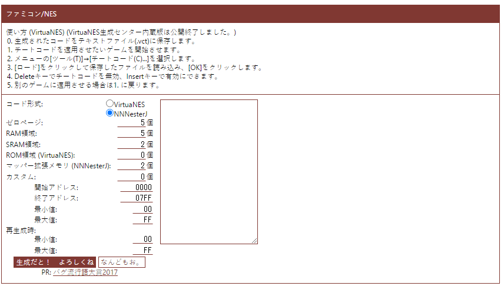

# Web-Based Corruptors

These are corruptors that run in your browser. 

## Urajijo

**Author: cbrk803832?**

**Release date: Sometime before 2013/01/14**

In Japan, corruptions are called チートバグ (cheatbug). There is a community of people who do cheatbugs.
There is a tool called Urajijo, which is an html with various "generation centers" where you can randomly generate cheatcodes for particular systems.
The tool is not in English but it is easy to use if you use a translator.

**Page URL**: https://web.archive.org/web/20190331033837/http://www.geocities.jp/cbrk803832/index.html

## Emoji/SVG Corrupt

**Made by**: x8BitRain

As its name implies, this is a web-based corruptor that works with SVG Vectorial Files. A quick selection of SVG Emojis is available to get started fast.

**Page URL**: [https://x8bitrain.github.io/svg-emoji-corrupt/](https://x8bitrain.github.io/svg-emoji-corrupt/)  
**Source** : [https://github.com/x8BitRain/svg-emoji-corrupt](https://github.com/x8BitRain/svg-emoji-corrupt)

## jsRTC 

jsRTC is a minimalist Real-Time Corruptor written in JavaScript. jsRTC works by creating a bookmark in your browser that contains the corruptor's code. It will pop a frame at the top-left corner of your browser, giving you control over the corruptor.

#### jsRTC for Webpages

This version of jsRTC is made to corrupt pages by scrambling it's CSS classes around.  
**Page URL:** [https://github.com/ircluzar/jsRTC/blob/master/jsRTC\_for\_Webpages.txt](https://github.com/ircluzar/jsRTC/blob/master/jsRTC_for_Webpages.txt)

**jsRTC for js-dosbox \(dosgamesarchives.com edition\)**

This version of jsRTC is made for a very particular website: dosgamesarchives.com  
that websites has a built-in dosbox emulator written in JavaScript to which jsRTC hooks to.  
**Page URL:** [https://github.com/ircluzar/jsRTC/blob/master/jsRTC\_for\_js-dosbox.txt](https://github.com/ircluzar/jsRTC/blob/master/jsRTC_for_js-dosbox.txt)

